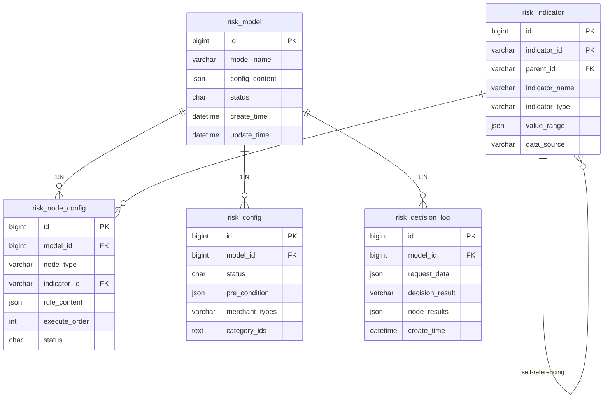

# 风控系统功能设计方案

## 📋 目录

- [项目概述](#项目概述)
  - [项目背景](#项目背景)
  - [核心目标](#核心目标)
  - [技术栈](#技术栈)
- [系统架构](#系统架构)
  - [整体架构图](#整体架构图)
  - [核心组件说明](#核心组件说明)
- [数据库设计](#数据库设计)
  - [表结构设计](#表结构设计)
  - [ER关系图](#er关系图)
  - [索引策略](#索引策略)
- [数据库初始化](#数据库初始化)
- [功能设计](#功能设计)
  - [决策流程](#决策流程)
  - [四大风控节点](#四大风控节点)
  - [模型配置管理](#模型配置管理)
  - [API接口设计](#api接口设计)
- [非功能性需求](#非功能性需求)
  - [性能优化](#性能优化)
  - [数据安全](#数据安全)
  - [扩展性设计](#扩展性设计)
- [部署运维](#部署运维)
- [附录](#附录)

## 📋 项目概述

### 项目背景

基于风控模型设计文档，开发一套完整的小租业务风控系统，支持多层次风险控制、灵活规则配置和实时决策能力。

### 核心目标

- 实现四大风控节点的完整功能
- 支持灵活的规则配置和管理
- 提供高性能的实时风控决策
- 确保系统的可扩展性和可维护性

### 技术栈

- **基础框架**: RuoYi-Vue-Plus 5.5.0
- **后端框架**: Spring Boot 3.5.6 (基于RuoYi-Vue-Plus)
- **Web服务器**: Undertow (XNIO高性能)
- **安全框架**: Sa-Token + Jwt (动态权限管理)
- **数据库**: MySQL
- **缓存**: Redis 5-7 (支持集群和哨兵模式)
- **Redis客户端**: Redisson (官方推荐)
- **ORM框架**: MyBatis-Plus (零SQL全Java编写)
- **数据权限**: Mybatis-Plus内置 (支持多种权限模式)
- **数据加密**: 注解 + Jackson (支持多种加密算法)
- **数据脱敏**: 注解 + Jackson (多种脱敏策略)
- **多数据源**: dynamic-datasource (动态切换)
- **数据库连接池**: HikariCP (Spring官方推荐)
- **分布式ID**: 雪花ID (适合分库分表)
- **序列化**: Jackson (Spring官方推荐)
- **定时任务**: SnailJob (分布式任务调度)
- **文件存储**: Minio (分布式文件存储)
- **对象存储**: AWS S3协议 (支持阿里云、腾讯云等)
- **接口文档**: SpringDoc + Javadoc (注解驱动)
- **Excel处理**: Alibaba EasyExcel (高性能)
- **工具类**: Hutool + Lombok
- **监控**: SpringBoot-Admin + Actuator
- **链路追踪**: Apache SkyWalking
- **前端**: Vue 3 + TypeScript + Element Plus
- **部署**: Docker (一键部署)

## 🏗️ 系统架构

### 整体架构图

```
┌─────────────────┐    ┌─────────────────┐    ┌─────────────────┐
│   业务系统       │────│   风控网关      │────│   决策引擎       │
└─────────────────┘    └─────────────────┘    └─────────────────┘
                                │                        │
                                ▼                        ▼
┌─────────────────┐    ┌─────────────────┐    ┌─────────────────┐
│   规则配置中心   │    │   数据服务层     │    │      数据源      │
└─────────────────┘    └─────────────────┘    └─────────────────┘
```

### 核心组件说明

| 组件             | 功能描述                    | 技术选型                 | 关键特性                       |
| ---------------- | --------------------------- | ------------------------ | ------------------------------ |
| **风控网关**     | 统一入口，请求路由和预处理  | RuoYi Gateway 模块       | 限流、熔断、认证               |
| **决策引擎**     | 核心风控逻辑执行            | Drools + 自研引擎        | 规则热更新、高性能             |
| **规则配置中心** | 风控规则和模型管理          | RuoYi Admin 模块         | 可视化配置、版本控制           |
| **数据服务层**   | 数据聚合和缓存              | RuoYi Service 层 + Redis | MyBatis-Plus、实时缓存         |
| **数据源**       | 本地数据/第三方风控数据接口 | RuoYi HTTP 客户端        | 芝麻信用、黑名单、第三方数据等 |

## 📊 数据库设计

### 表结构设计

### 1. 风控模型表 (risk_model)

```sql{3-5}
CREATE TABLE `risk_model` (
  `id` bigint(20) NOT NULL AUTO_INCREMENT COMMENT '主键ID',
  `model_name` varchar(128) NOT NULL COMMENT '模型名称',
  `config_content` json COMMENT '配置内容(节点配置)',
  `status` char(1) DEFAULT '1' COMMENT '状态: 1-启用, 0-禁用',
  `del_flag` char(1) DEFAULT '0' COMMENT '删除标志',
  `create_by` varchar(64) DEFAULT '' COMMENT '创建者',
  `create_time` datetime DEFAULT CURRENT_TIMESTAMP COMMENT '创建时间',
  `update_by` varchar(64) DEFAULT '' COMMENT '更新者',
  `update_time` datetime DEFAULT CURRENT_TIMESTAMP ON UPDATE CURRENT_TIMESTAMP COMMENT '更新时间',
  `remark` varchar(500) DEFAULT NULL COMMENT '备注',
  PRIMARY KEY (`id`)
) ENGINE=InnoDB DEFAULT CHARSET=utf8mb4 COMMENT='风控模型表';
```

### 2. 风控节点配置表 (risk_node_config)

```sql{3-10}
CREATE TABLE `risk_node_config` (
  `id` bigint(20) NOT NULL AUTO_INCREMENT COMMENT '主键ID',
  `model_id` bigint(20) NOT NULL COMMENT '模型ID',
  `node_type` varchar(32) NOT NULL COMMENT '节点类型',
  `indicator_id` varchar(64) COMMENT '指标ID',
  `indicator_name` varchar(128) COMMENT '指标名称',
  `rule_content` json COMMENT '规则配置',
  `result_mapping` json COMMENT '结果映射配置',
  `execute_order` int(11) DEFAULT '0' COMMENT '执行顺序',
  `status` char(1) DEFAULT '1' COMMENT '状态: 1-启用, 0-禁用',
  `del_flag` char(1) DEFAULT '0' COMMENT '删除标志',
  `create_by` varchar(64) DEFAULT '' COMMENT '创建者',
  `create_time` datetime DEFAULT CURRENT_TIMESTAMP COMMENT '创建时间',
  `update_by` varchar(64) DEFAULT '' COMMENT '更新者',
  `update_time` datetime DEFAULT CURRENT_TIMESTAMP ON UPDATE CURRENT_TIMESTAMP COMMENT '更新时间',
  `remark` varchar(500) DEFAULT NULL COMMENT '备注',
  PRIMARY KEY (`id`),
  KEY `idx_model_id` (`model_id`),
  KEY `idx_node_type` (`node_type`)
) ENGINE=InnoDB DEFAULT CHARSET=utf8mb4 COMMENT='风控节点配置表';
```

### 3. 风控指标表 (risk_indicator)

```sql{3-10}
CREATE TABLE `risk_indicator` (
  `id` bigint(20) NOT NULL AUTO_INCREMENT COMMENT '主键ID',
  `indicator_id` varchar(64) NOT NULL COMMENT '指标ID',
  `parent_id` varchar(64) COMMENT '父指标ID',
  `indicator_name` varchar(128) NOT NULL COMMENT '指标名称',
  `indicator_type` varchar(32) NOT NULL COMMENT '指标类型',
  `value_range` json COMMENT '取值范围配置',
  `data_source` varchar(32) NOT NULL COMMENT '数据来源',
  `provider` varchar(64) COMMENT '数据提供商',
  `status` char(1) DEFAULT '1' COMMENT '状态: 1-启用, 0-禁用',
  `del_flag` char(1) DEFAULT '0' COMMENT '删除标志',
  `create_by` varchar(64) DEFAULT '' COMMENT '创建者',
  `create_time` datetime DEFAULT CURRENT_TIMESTAMP COMMENT '创建时间',
  `update_by` varchar(64) DEFAULT '' COMMENT '更新者',
  `update_time` datetime DEFAULT CURRENT_TIMESTAMP ON UPDATE CURRENT_TIMESTAMP COMMENT '更新时间',
  `remark` varchar(500) DEFAULT NULL COMMENT '备注',
  PRIMARY KEY (`id`),
  UNIQUE KEY `uk_indicator_id` (`indicator_id`),
  KEY `idx_parent_id` (`parent_id`)
) ENGINE=InnoDB DEFAULT CHARSET=utf8mb4 COMMENT='风控指标表';
```

### 4. 风控决策记录表 (risk_decision_log)

```sql
CREATE TABLE `risk_decision_log` (
  `id` bigint(20) NOT NULL AUTO_INCREMENT COMMENT '主键ID',
  `model_id` bigint(20) NOT NULL COMMENT '使用的模型ID',
  `request_data` json COMMENT '请求数据',
  `decision_result` varchar(32) NOT NULL COMMENT '决策结果',
  `node_results` json COMMENT '各节点执行结果',
  `score` int(11) COMMENT '风险评分',
  `reason` varchar(512) COMMENT '决策原因',
  `execute_time` int(11) COMMENT '执行耗时(ms)',
  `del_flag` char(1) DEFAULT '0' COMMENT '删除标志',
  `create_by` varchar(64) DEFAULT '' COMMENT '创建者',
  `create_time` datetime DEFAULT CURRENT_TIMESTAMP COMMENT '创建时间',
  `update_by` varchar(64) DEFAULT '' COMMENT '更新者',
  `update_time` datetime DEFAULT CURRENT_TIMESTAMP ON UPDATE CURRENT_TIMESTAMP COMMENT '更新时间',
  `remark` varchar(500) DEFAULT NULL COMMENT '备注',
  PRIMARY KEY (`id`),
  KEY `idx_model_id` (`model_id`),
  KEY `idx_created_time` (`create_time`)
) ENGINE=InnoDB DEFAULT CHARSET=utf8mb4 COMMENT='风控决策记录表';
```

### ER关系图



### 索引策略

| 表名              | 索引名           | 字段         | 索引类型 | 说明         |
| ----------------- | ---------------- | ------------ | -------- | ------------ |
| risk_model        | idx_status       | status       | NORMAL   | 状态查询     |
| risk_node_config  | idx_model_id     | model_id     | NORMAL   | 模型关联查询 |
| risk_node_config  | idx_node_type    | node_type    | NORMAL   | 节点类型查询 |
| risk_indicator    | uk_indicator_id  | indicator_id | UNIQUE   | 指标唯一性   |
| risk_indicator    | idx_parent_id    | parent_id    | NORMAL   | 层级关系查询 |
| risk_config       | idx_model_id     | model_id     | NORMAL   | 模型配置查询 |
| risk_decision_log | idx_model_id     | model_id     | NORMAL   | 模型效果分析 |
| risk_decision_log | idx_created_time | create_time  | NORMAL   | 时间范围查询 |

## 🚀 数据库初始化

### 初始化脚本说明

#### 脚本执行顺序

1. **表结构创建**: 创建5个核心数据表
2. **索引创建**: 建立性能优化索引
3. **基础数据插入**: 初始化风控指标和默认模型
4. **权限设置**: 配置数据库访问权限

#### 风控模块数据库初始化脚本

```sql
-- 风控模块数据库初始化脚本

-- 插入初始化数据

-- 1. 插入风控指标基础数据
INSERT INTO `risk_indicator` (`indicator_id`, `indicator_name`, `indicator_type`, `value_range`, `data_source`, `status`, `created_time`) VALUES
('AGE', '年龄', 'RANGE', '{"min": 18, "max": 65}', 'INTERNAL', '1', NOW()),
('HOUSEHOLD_LOCATION', '户籍地', 'OPTION', '{"type": "BLACKLIST", "values": ""}', 'INTERNAL', '1', NOW()),
('DELIVERY_LOCATION', '收货地', 'OPTION', '{"type": "BLACKLIST", "values": ""}', 'INTERNAL', '1', NOW()),
('PHONE_STATUS', '手机号状态', 'HIT', '{"action": "CHECK"}', 'EXTERNAL', '1', NOW()),
('INTERNAL_BLACKLIST', '内部黑名单', 'HIT', '{"action": "REJECT"}', 'INTERNAL', '1', NOW()),
('EXTERNAL_BLACKLIST', '外部黑名单', 'HIT', '{"action": "REJECT"}', 'EXTERNAL', '1', NOW()),
('ZHIMA_CREDIT', '芝麻信用', 'RANGE', '{"levels": ["R0","R1","R2","R3","R4","R5","R6"]}', 'EXTERNAL', '1', NOW()),
('DEBTOR_INFO', '被执行人', 'HIT', '{"action": "MANUAL"}', 'EXTERNAL', '1', NOW()),
('CRIMINAL_CASE', '刑事案件', 'HIT', '{"action": "REJECT"}', 'EXTERNAL', '1', NOW());

-- 2. 插入默认风控模型
INSERT INTO `risk_model` (`model_name`, `config_content`, `status`, `created_time`) VALUES
('默认风控模型', '{"description": "默认风控模型，适用于大部分业务场景"}', '1', NOW());

-- 3. 插入默认节点配置
INSERT INTO `risk_node_config` (`model_id`, `node_type`, `indicator_id`, `indicator_name`, `rule_content`, `result_mapping`, `execute_order`, `status`, `created_time`) VALUES
(1, 'APPLICANT_LIMIT', 'AGE', '年龄检查', '{"min": 18, "max": 65}', '{"reject": "FULL_DEPOSIT"}', 1, '1', NOW()),
(1, 'APPLICANT_LIMIT', 'HOUSEHOLD_LOCATION', '户籍地检查', '{"type": "BLACKLIST", "values": ""}', '{"reject": "FULL_DEPOSIT"}', 2, '1', NOW()),
(1, 'APPLICANT_LIMIT', 'DELIVERY_LOCATION', '收货地检查', '{"type": "BLACKLIST", "values": ""}', '{"reject": "FULL_DEPOSIT"}', 3, '1', NOW()),
(1, 'APPLICANT_LIMIT', 'PHONE_STATUS', '手机号状态检查', '{"action": "CHECK"}', '{"reject": "FULL_DEPOSIT"}', 4, '1', NOW()),
(1, 'FRAUD_WARNING', 'INTERNAL_BLACKLIST', '内部黑名单检查', '{"action": "REJECT"}', '{"reject": "REJECT"}', 5, '1', NOW()),
(1, 'FRAUD_WARNING', 'EXTERNAL_BLACKLIST', '外部黑名单检查', '{"action": "REJECT"}', '{"reject": "REJECT"}', 6, '1', NOW()),
(1, 'ZHIMA_CREDIT', 'ZHIMA_CREDIT', '芝麻信用评估', '{"levels": ["R0","R1","R2","R3","R4","R5","R6"]}', '{"R0,R1,R2": "PASS", "R3,R4": "MANUAL", "R5,R6": "REJECT"}', 7, '1', NOW()),
(1, 'CASE_INFO', 'DEBTOR_INFO', '被执行人检查', '{"action": "MANUAL"}', '{"hit": "MANUAL"}', 8, '1', NOW()),
(1, 'CASE_INFO', 'CRIMINAL_CASE', '刑事案件检查', '{"action": "REJECT"}', '{"hit": "REJECT"}', 9, '1', NOW());

-- 4. 插入默认风控配置
INSERT INTO `risk_config` (`model_id`, `status`, `pre_condition`, `merchant_types`, `merchant_scope`, `order_types`, `category_ids`, `created_time`) VALUES
(1, '1', '[]', '["B","C"]', '["MANAGED","NON_MANAGED"]', '["NORMAL","CHANNEL","SELF_PROMOTE","PUBLIC"]', '[]', NOW());

-- 创建索引
CREATE INDEX idx_risk_decision_order_id ON risk_decision_log(order_id);
CREATE INDEX idx_risk_decision_user_id ON risk_decision_log(user_id);
CREATE INDEX idx_risk_decision_created_time ON risk_decision_log(created_time);
CREATE INDEX idx_risk_node_model_id ON risk_node_config(model_id);
CREATE INDEX idx_risk_config_model_id ON risk_config(model_id);
```

## 🔧 功能设计

### 1. 风控决策流程

#### 决策流程图

```
订单请求 → 获取适用模型 → 节点1(进件限制) → 节点2(反欺诈预警) → 节点3(芝麻免押) → 节点4(案件信息) → 综合评估 → 决策结果
    ↓              ↓              ↓              ↓              ↓              ↓           ↓
 订单信息     模型配置查询     年龄/地域检查   黑名单检查      芝麻信用评估    法律风险检查   结果输出
 业务参数     规则节点获取     手机号验证     欺诈识别        信用等级判断    被执行人查询   风险等级
 用户信息     缓存模型配置     基础门槛控制   风险预警        风险等级分类    刑事案件核查   决策建议
```

#### 决策结果类型

- **PASS**: 通过风控检查，直接通过
- **MANUAL**: 需要人工审核
- **REJECT**: 拒绝申请
- **FULL_DEPOSIT**: 要求支付全额押金

### 2. 四大风控节点功能

#### 2.1 进件限制节点 (APPLICANT_LIMIT)

**功能**: 基础门槛控制，防止明显不符合条件的申请

**检查项目**:

- **年龄限制**: 18-65岁
- **户籍地限制**: 支持黑名单/白名单模式
- **收货地限制**: 支持地域限制
- **手机号状态**: 检查是否为销号、停机、非实名手机

**规则配置示例**:

```json
{
  "age": {
    "min": 18,
    "max": 65
  },
  "household": {
    "type": "BLACKLIST",
    "values": "地区1,地区2,地区3"
  },
  "delivery": {
    "type": "BLACKLIST",
    "values": ""
  },
  "phone": {
    "action": "CHECK"
  }
}
```

**处理逻辑**:

- 触发任一限制条件 → 要求全额押金
- 全部通过 → 进入下一节点

#### 2.2 反欺诈预警节点 (FRAUD_WARNING)

**功能**: 识别潜在欺诈风险，保护平台安全

**检查项目**:

- **内部黑名单**: 平台历史风险用户
- **外部黑名单**: 第三方风险数据
- **设备指纹**: 设备风险评估
- **行为分析**: 异常行为模式识别

**规则配置示例**:

```json
{
  "internal_blacklist": {
    "action": "REJECT"
  },
  "external_blacklist": {
    "action": "REJECT",
    "providers": ["provider1", "provider2"]
  },
  "device_risk": {
    "enabled": true,
    "threshold": 80
  }
}
```

**处理逻辑**:

- 命中黑名单 → 直接拒绝
- 高风险行为 → 转人工审核

#### 2.3 芝麻免押节点 (ZHIMA_CREDIT)

**功能**: 基于芝麻信用进行风险评估

**风险等级划分**:

- **R0-R2**: 信用优秀 → 自动通过
- **R3-R4**: 信用中等 → 转人工审核
- **R5-R6**: 信用较差 → 直接拒绝

**规则配置示例**:

```json
{
  "zhima_credit": {
    "enabled": true,
    "levels": ["R0", "R1", "R2", "R3", "R4", "R5", "R6"],
    "mapping": {
      "R0,R1,R2": "PASS",
      "R3,R4": "MANUAL",
      "R5,R6": "REJECT"
    }
  }
}
```

**处理逻辑**:

- 根据芝麻信用分确定风险等级
- 按风险等级执行相应处理策略

#### 2.4 案件信息节点 (CASE_INFO)

**功能**: 法律风险核查，确保用户信用良好

**检查项目**:

- **被执行人信息**: 法院被执行人记录
- **刑事案件**: 刑事案件记录
- **失信被执行人**: 失信名单查询
- **限制消费人员**: 限高名单查询

**规则配置示例**:

```json
{
  "debtor_info": {
    "action": "MANUAL",
    "enabled": true
  },
  "criminal_case": {
    "action": "REJECT",
    "enabled": true
  },
  "dishonest_info": {
    "action": "REJECT",
    "enabled": true
  }
}
```

**处理逻辑**:

- 发现刑事案件 → 直接拒绝
- 发现被执行记录 → 转人工审核
- 无不良记录 → 通过检查

### 3. 模型配置管理

#### 3.1 模型版本管理

- **版本控制**: 支持模型版本管理
- **灰度发布**: 支持模型灰度发布
- **回滚机制**: 支持模型版本回滚
- **A/B测试**: 支持模型效果对比

#### 3.2 节点配置管理

- **动态配置**: 支持节点参数动态调整
- **规则引擎**: 灵活的规则配置语法
- **条件判断**: 复杂的条件逻辑支持
- **权重配置**: 节点权重和优先级设置

#### 3.3 适用场景配置

- **商家类型**: B端/C端商家区分
- **订单类型**: 普通/渠道/自推广/公域订单
- **商品类目**: 按类目差异化配置
- **前置条件**: 复杂的前置条件判断

### 4. 性能优化设计

#### 4.1 缓存策略

- **模型缓存**: 模型配置缓存(5分钟)
- **规则缓存**: 规则配置缓存
- **结果缓存**: 决策结果短期缓存
- **黑名单缓存**: 黑名单数据缓存

#### 4.2 并发处理

- **分布式锁**: 防止重复决策
- **异步处理**: 日志异步保存
- **批量处理**: 支持批量决策请求
- **连接池**: 数据库连接池优化

#### 4.3 监控告警

- **性能监控**: 决策耗时监控
- **准确率监控**: 决策结果准确性
- **异常监控**: 系统异常告警
- **业务监控**: 业务指标监控

### 5. 数据安全设计

#### 5.1 数据加密

- **传输加密**: HTTPS传输加密
- **存储加密**: 敏感数据加密存储
- **密钥管理**: 安全的密钥管理机制
- **访问控制**: 细粒度访问控制

#### 5.2 隐私保护

- **数据脱敏**: 敏感信息脱敏
- **权限控制**: 基于角色的权限控制
- **审计日志**: 完整的操作审计
- **合规要求**: 满足数据保护法规

### 6. 扩展性设计

#### 6.1 节点扩展

- **插件化设计**: 节点处理器插件化
- **热插拔**: 支持节点热插拔
- **版本兼容**: 向后兼容性保证
- **接口标准**: 标准化的节点接口

#### 6.2 规则扩展

- **规则引擎**: 可扩展的规则引擎
- **脚本支持**: 支持自定义脚本规则
- **机器学习**: 支持ML模型集成
- **外部集成**: 第三方服务集成

#### 6.3 数据源扩展

- **多数据源**: 支持多种数据源
- **实时数据**: 实时数据接入
- **批量数据**: 批量数据处理
- **数据治理**: 数据质量管理

---

**最后更新**: 2025-10-25
**文档版本**: v4.0.0 (功能设计版)
**维护人员**: 风控系统开发团队
