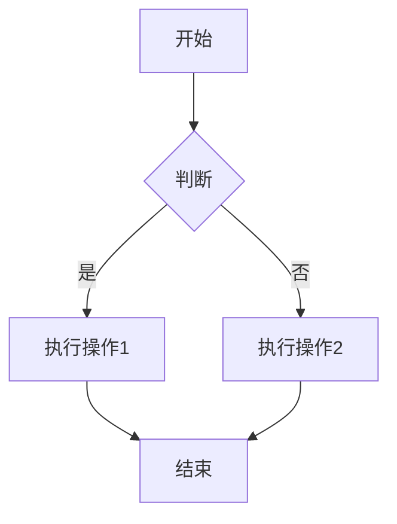

# 文档编写说明

### Markdown

文档编写采用 Markdown 格式，及生成的文件为`**.md`后缀的文件，从而通过`vitepress`渲染出文档内容, 并生成 html文件
如果你对markdown编写不太熟悉，如下是一份使用说明，可以参考此网站 [Markdown教程](https://markdown.com.cn/)

::: info 提示
此文档借助了AI，可能不准确，请自行斟酌
:::

## 基础语法

### 标题

使用 `#` 符号创建标题，支持 1-6 级标题：

```markdown
# 一级标题

## 二级标题

### 三级标题

#### 四级标题

##### 五级标题

###### 六级标题
```

### 文本样式

```markdown
**粗体文本**
_斜体文本_
**_粗斜体文本_**
~~删除线文本~~
`行内代码`
```

**效果展示：**

**粗体文本**  
_斜体文本_  
**_粗斜体文本_**  
~~删除线文本~~  
`行内代码`

### 段落与换行

- 段落之间用空行分隔
- 行末添加两个空格可实现换行
- 或使用 `<br>` 标签换行

```markdown
这是第一段内容。

这是第二段内容。

这是同一段的第一行  
这是同一段的第二行
```

### 列表

**无序列表：**

```markdown
- 项目 1
- 项目 2
  - 子项目 2.1
  - 子项目 2.2
- 项目 3

* 也可以使用星号

- 或使用加号
```

**有序列表：**

```markdown
1. 第一项
2. 第二项
3. 第三项
   1. 子项 3.1
   2. 子项 3.2
```

**效果展示：**

1. 第一项
2. 第二项
3. 第三项
   1. 子项 3.1
   2. 子项 3.2

### 链接

```markdown
[链接文本](https://example.com)
[带标题的链接](https://example.com '鼠标悬停显示的标题')
[相对路径链接](./other-page.md)
```

**效果展示：**

[VitePress 官网](https://vitepress.dev)

### 图片

```markdown


```

### 引用

```markdown
> 这是一段引用文本
>
> 可以有多行
>
> > 也可以嵌套引用
```

**效果展示：**

> 这是一段引用文本
>
> 可以有多行

### 代码块

**行内代码：**

```markdown
使用 `console.log()` 输出信息
```

**多行代码块：**

````markdown
```javascript
function hello() {
  console.log('Hello World!')
}
```
````

### 高亮及代码块：

```typescript{2,4-6}
interface User {
  name: string  // 高亮
  age: number
  email: string  // 高亮
  address: string  // 高亮
  phone: string  // 高亮
}
```

### 表格

| 列 1   | 列 2   | 列 3   |
| ------ | ------ | ------ |
| 内容 1 | 内容 2 | 内容 3 |
| 内容 4 | 内容 5 | 内容 6 |

#### 对齐方式

| 左对齐 | 居中对齐 | 右对齐 |
| :----- | :------: | -----: |
| 内容 1 |  内容 2  | 内容 3 |
| 内容 4 |  内容 5  | 内容 6 |

### 分隔线

使用三个或更多的 -、\* 或 \_ 创建分隔线：

`---` `***` `___`

## vitepress 扩展

```
::: info 提示
这是一条提示信息
:::

::: tip 建议
这是一条建议信息
:::

::: warning 警告
这是一条警告信息
:::

::: danger 危险
这是一条危险警告信息
:::

::: details 点击展开
这是一个可折叠的详情块
:::
```

效果如下：
::: info 提示
这是一条提示信息
:::

::: tip 建议
这是一条建议信息
:::

::: warning 警告
这是一条警告信息
:::

::: danger 危险
这是一条危险警告信息
:::

::: details 点击展开
这是一个可折叠的详情块
:::

### 代码组

将多个代码块组合成一个选项卡组，这里只展示了效果，详细请参考目录下 `/docs/how-to-write/index.md`

::: code-group

```javascript [JavaScript]
console.log('Hello from JavaScript')
```

```typescript [TypeScript]
console.log('Hello from TypeScript')
```

```python [Python]
print('Hello from Python')
```

:::

#### 代码块中的文件路径，

这里只展示了效果，详细请参考目录下 `/docs/how-to-write/index.md`

```typescript
// filepath: /src/main.ts
import { createApp } from 'vue'
import App from './App.vue'

createApp(App).mount('#app')
```

#### 代码块中的路径

这里只展示了效果，详细请参考目录下 `/docs/how-to-write/index.md`

```typescript
// filepath: /src/main.ts
import { createApp } from 'vue'
import App from './App.vue'

createApp(App).mount('#app')
```

#### 行高亮

这里只展示了效果，详细请参考目录下 `/docs/how-to-write/index.md`

```typescript{2,4-6}
export default {
  data() {  // 高亮
    return {
      message: 'Hello',  // 高亮
      count: 0,          // 高亮
      items: []          // 高亮
    }
  }
}
```

#### 行号

这里只展示了效果，详细请参考目录下 `/docs/how-to-write/index.md`

```typescript:line-numbers
// 显示行号
const hello = 'world'
```

```typescript:no-line-numbers
// 不显示行号
const hello = 'world'
```

#### 目录结构展示

这里只展示了效果，详细请参考目录下 `/docs/how-to-write/index.md`

```tree
project/
├── src/
│   ├── components/
│   │   ├── Button.vue
│   │   └── Input.vue
│   ├── views/
│   │   └── Home.vue
│   └── main.ts
└── [package.json](http://_vscodecontentref_/0)
```

### 链接与导航

#### 内部链接

```
[路由配置](./router.md)
[组件文档](../components/button.md)
[首页](/)
```

#### 锚点链接

```
[跳转到基础语法](#基础语法)
[跳转到表格](#表格)
```

### 图标支持

VitePress 支持 Mermaid 图表：
不过这里需要配置 vscode，这里没有做



以上, 另外, vitepress官网会有详细介绍
